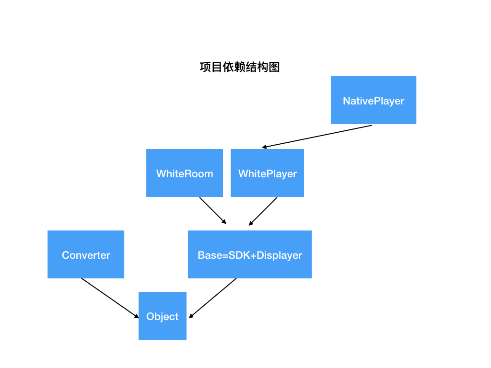

# Whiteboard

本项目为 White-SDK-iOS 的开源版本，为了更好的显示源码结构，`Whiteboard` 将项目分为了多个`subpod`，更有利于开发者查看项目源码层级。为此需要修改引用关系。

## TOC

- [文档](#文档)
- [Example](#Example)
    - [快速调试](#快速调试)
- [项目结构](#项目结构)
- [音视频支持](#Native音视频)
- [动态PPT本地资源包](#动态ppt本地资源包)
- [部分问题](#部分问题)

## 文档

[API 文档](https://developer.netless.link)

## 引用

在 Podfile 中写入

```
pod 'whiteboard'
```

### White-SDK-iOS 迁移

只需要将

```Objective-C
#import <White-SDK-iOS/WhiteSDK.h>
```

修改为

```Objective-C
#import <Whiteboard/Whiteboard.h>
```

即可。

使用时，只要 import 以下内容即可。

```Objective-C
#import <Whiteboard/Whiteboard.h>
# 使用白板sdk中任意类
```

## Example

* 启动Example

```shell
cd Example
pod install
```

进入Example文件夹，打开 `Example.xcworkspace` 项目文件。

>同时在 `WhiteUtils.m` 根据代码注释填写内容。

```Objective-C
/* FIXME: sdkToken
 请在 https://console.netless.link 注册并获取 sdk token
 该 sdk token 不应该保存在客户端中，所有涉及 sdk token 的请求（当前类中所有请求），都应该放在服务器中进行，以免泄露产生不必要的风险。
 */
#ifndef WhiteSDKToken
#define WhiteSDKToken <#@sdk Token#>
#endif

/** FIXME: 2.8.0 新增必填项 AppIdentitier，通过该 API 可以避免大量预先的网络请求，极大增加异常网络下，用户的连通率。
 请在 https://console.netless.link 中进行获取。
 */
#ifndef WhiteAppIdentifier
#define WhiteAppIdentifier <#@App identifier#>
#endif
```

### 快速调试

如果需要进入确定的房间进行调试，找到`Whiteboard-Prefix.pch`文件中，填写以下代码：

```C
#define WhiteAppIdentifier @"792/uaYcRG0I7ctP9A"
//有 UUID 和 RoomToken 时，只要不在输入栏填写 UUID，WhiteSDKToken 就不会被使用，直接写空占位，保证不报错即可。
//如果在这里有填写任意值，WhiteUtils.m 中的值，就不会被使用
#define WhiteSDKToken @""
#define WhiteRoomUUID @"xxxx"
#define WhiteRoomToken @"wwwwwwwww"
```

此时，实时/回放房间，如果在加入时，没有填写房间 UUID，都会进入该房间。

### 单元测试

单元测试需要对某些特殊行为进行测试，所以需要对应房间有以下操作：

1. 调用过插入图片接口（从单元测试启动的房间，已经开启了图片拦截功能）
1. 发送过特定的自定义事件（已定义在单元测试代码中）
1. 发送过大量自定义事件

## 要求设备

运行设备：iOS 9 + (推荐iOS 10以上使用，以获得更佳体验)
开发环境：Xcode 10+

## 项目结构

SDK由多个`subpod`组成，依赖结构如下图所示：



>参数配置类：用于描述和存储API参数，返回值，状态等配置项的类。主要用于与`webview`进行交互。

1. Object：主要作用是通过`YYModel`处理`JSON`转换。包含以下部分：
    1. `Object`基类，所有`sdk`中使用的参数配置类的基类。
    2. `Room`，`Player`中API所涉及到的一些参数配置类。
2. Base：包含`SDK``Displayer`以及部分相关类，主要为以下部分：
    1. `WhiteSDK`以及其初始化参数类。
    2. `WhiteSDK`设置的通用回调`WhiteCommonCallbacks`
    3. `Room`与`Player`共同的父类`Displayer`类的实现。
    4. `Displayer`中API所使用的一些参数配置类。
    5. `Displayer`用来描述当前房间状态的类，为`RoomState`,`PlayerState`的基类。
3. Room：实时房间相关内容：
    1. `Room`类，及其相关事件回调类。
    1. `WhiteSDK+Room`，使用`SDK`创建`Room`的API。
    1. `Room`特有的参数配置类。
    1. 描述`Room`状态相关的类。
4. Player：回放房间相关内容：
    1. `Player`类，及其相关事件回调类。
    1. `WhiteSDK+Player`，使用`SDK`创建`Player`的API。
    1. `Player`特有的参数配置类。
    1. 描述`Player`状态相关的类。
5. NativePlayer：在`iOS`端播放音视频，并与白板播放状态做同步
    1. `WhiteCombinePlayer`类，及其相关部分类。
6. Converter：动静态转换请求封装类。
    * 动静态转换计费以QPS（日并发）计算，客户端无法控制并发，不推荐在生产环境下使用。详情请参考文档。

## Native音视频

sdk 现在支持使用 CombinePlayer，在 Native 端播放音视频，sdk 会负责音视频与白板回放的状态同步。
具体代码示例，可以参看 `WhitePlayerViewController`

>m3u8 格式的音视频，可能需要经过一次 combinePlayerEndBuffering 调用后，才能进行`seek`播放。（否则可能仍然从初始位置开始播放）

```Objective-C
#import <Whiteboard/Whiteboard.h>

@implementation WhitePlayerViewController

- (void)initPlayer
{

    // 创建 WhitePlayer逻辑
    // 1. 配置 SDK 初始化参数，更多参数，可见 WhiteSdkConfiguration 头文件
    WhiteSdkConfiguration *config = [[WhiteSdkConfiguration alloc] initWithApp:[WhiteUtils appIdentifier]];
    // 2. 初始化 SDK
    self.sdk = [[WhiteSDK alloc] initWithWhiteBoardView:self.boardView config:config commonCallbackDelegate:self.commonDelegate];

    // 3. 配置 WhitePlayerConfig，room uuid 与 roomToken 为必须。其他更多参数，见 WhitePlayerConfig.h 头文件
    WhitePlayerConfig *playerConfig = [[WhitePlayerConfig alloc] initWithRoom:self.roomUuid roomToken:self.roomToken];
    
    //音视频，白板混合播放处理类
    self.combinePlayer = [[WhiteCombinePlayer alloc] initWithMediaUrl:[NSURL URLWithString:@"https://netless-media.oss-cn-hangzhou.aliyuncs.com/c447a98ece45696f09c7fc88f649c082_3002a61acef14e4aa1b0154f734a991d.m3u8"]];
    //显示 AVPlayer 画面
    [self.videoView setAVPlayer:self.combinePlayer.nativePlayer];
    //配置代理
    self.combinePlayer.delegate = self;
    
    [self.sdk createReplayerWithConfig:playerConfig callbacks:self.eventDelegate completionHandler:^(BOOL success, WhitePlayer * _Nonnull player, NSError * _Nonnull error) {
        if (self.playBlock) {
            self.playBlock(player, error);
        } else if (error) {
            NSLog(@"创建回放房间失败 error:%@", [error localizedDescription]);
        } else {
            self.player = player;
            [self.player addHighFrequencyEventListener:@"a" fireInterval:1000];
            
            //配置 WhitePlayer
            self.combinePlayer.whitePlayer = player;
            //WhitePlayer 需要先手动 seek 到 0 才会触发缓冲行为
            [player seekToScheduleTime:0];
        }
    }];
}

#pragma mark - WhitePlayerEventDelegate

- (void)phaseChanged:(WhitePlayerPhase)phase
{
    NSLog(@"player %s %ld", __FUNCTION__, (long)phase);
    // 注意！必须完成该操作，WhiteCombinePlayer 才能正确同步状态
    [self.combinePlayer updateWhitePlayerPhase:phase];
}

// 其他回调方法...

#pragma mark - WhiteCombinePlayerDelegate
- (void)combinePlayerStartBuffering
{
    //任意一端进入缓冲
    NSLog(@"combinePlayerStartBuffering");
}

- (void)combinePlayerEndBuffering
{
    //两端都结束缓冲
    NSLog(@"combinePlayerEndBuffering");
}

@end

```

## 动态ppt本地资源包

原理：提前下载动态转换所有需要的资源包，使用 WKWebView iOS 11 开始支持的自定义 scheme 请求，拦截 webView 请求，返回 native 端本地资源。

具体实现，请查看 git 记录：

1. 所需依赖：`add dependency to demo for ppt zip feature`
2. 代码实现：`implement local zip`

[动态转换资源包](https://developer.netless.link/docs/server/api/server-dynamic-conversion-zip/)

## 部分问题

1. 目前 SDK 关键字为`White`，未严格使用前置三大写字母做前缀。
